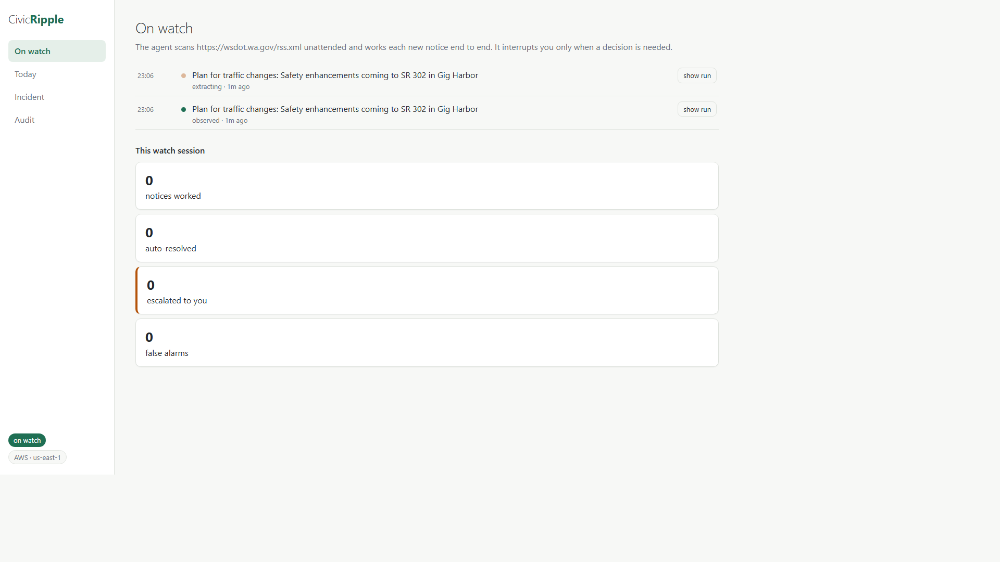
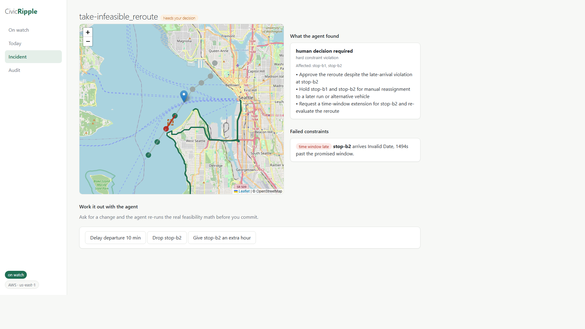
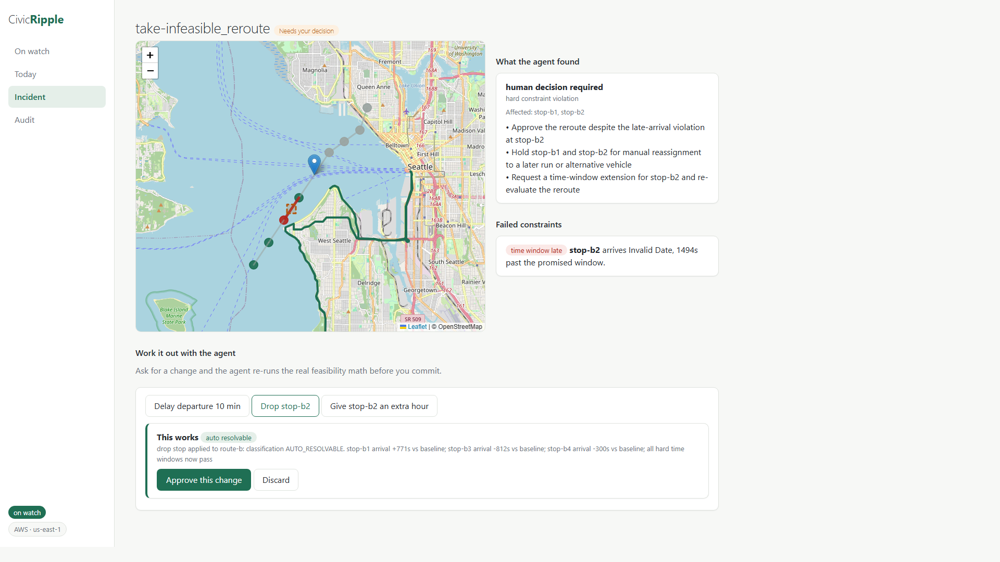
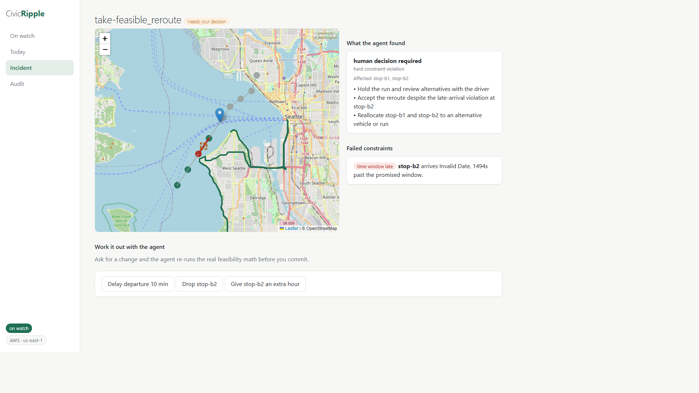
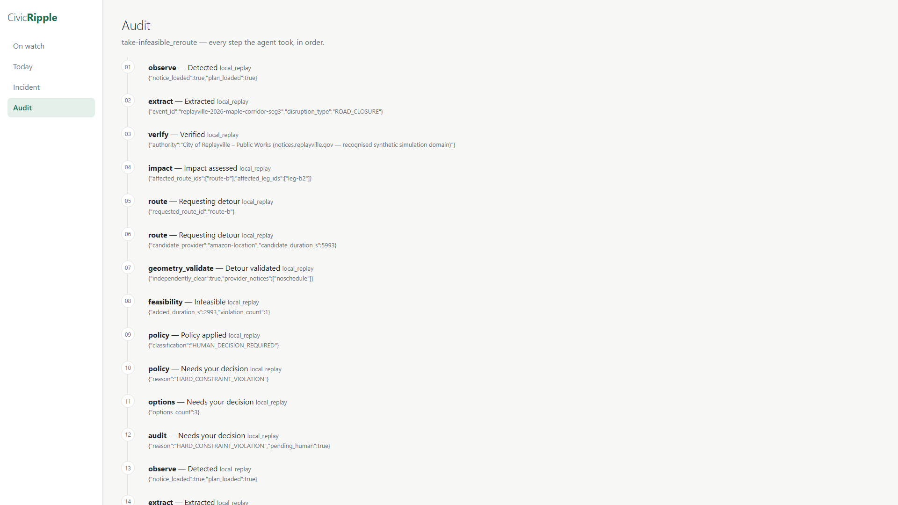

# CivicRipple

An autonomous community continuity agent built on the **Strands Agents
SDK**: it monitors a real municipal road-closure feed unattended, computes
operational impact through a deterministic core (geometry, feasibility,
policy — zero LLM calls), reroutes safely via Amazon Location with
independently-validated avoidance, and interrupts a human coordinator only
when a real operational decision is required — offering a what-if console
that re-runs the real feasibility math on proposed changes.

**Watch the 2-minute demo:** https://youtu.be/u0DkOVIZ3Oc

Hackathon: Agents for Humans Hackathon 2026 — Good Neighbor Agents track.
License: MIT (see `LICENSE`). Deployed agent: Amazon Bedrock AgentCore
Runtime. Architecture: `docs/architecture-diagram.md`.

**The coordinator's view** — the agent at work on the real WSDOT feed, and
a review with the map (closure in orange, affected leg in red, the agent's
independently-validated detour in green):

| On watch | Needs your decision | What-if result | Map | Audit |
|---|---|---|---|---|
|  |  |  |  |  |

## Run the demo (no AWS required)

    uv sync --dev
    MODE=local_replay uv run uvicorn civicripple.app:app --port 8000

Open http://localhost:8000 — the badge shows the active mode
(local_replay). Use the replay buttons on the Today view:

- **no impact** — a notice that does not affect any route (resolves silently)
- **feasible reroute** — the agent reroutes around a closure and resolves
  without human help
- **infeasible reroute** — the reroute breaks a delivery window; the
  coordinator reviews affected stops, failed constraints, bounded
  options, then approves or rejects
- **avoidance failure** — the routing provider's route still crosses the
  closure; the agent rejects it and asks a human

The Audit view shows every step: agent nodes, deterministic checks,
policy classification, and the final outcome.

## On watch (real feeds, unattended)

Start the service with the watch loop on and it scans the **real WSDOT
feed** every few minutes, runs each new notice through the full Strands
graph (live Bedrock in AWS mode; scripted models offline on cached real
data), and shows the activity live on the "On watch" tab:

    WATCH_ENABLED=1 MODE=aws AWS_PROFILE=<profile> DYNAMODB_TABLE=civicripple-demo uv run uvicorn civicripple.app:app --port 8000

## What-if console

During a review, ask for a change — drop a stop, delay the departure,
shift a window — and the agent re-runs the real feasibility math before
you commit. A variant that passes the same fail-closed policy gate can be
approved into the plan; one that doesn't is refused with the computed
reasons.

## AWS mode

With credentials configured (`aws login --profile <name>`; table and
region in the environment), this runs the same product against Amazon
Bedrock, Amazon Location Routes, and DynamoDB:

    MODE=aws uv run uvicorn civicripple.app:app --port 8000

Live demo modes, no redeployment needed:

- **live replays** — checkbox on the Today view: replay scenarios through
  the real Amazon Bedrock model (pennies) instead of the scripted offline
  model; failures fail loud, never silently scripted.
- **cloud replays** — run on the deployed **Amazon Bedrock AgentCore
  Runtime** (real Bedrock + Amazon Location + DynamoDB on the runtime
  side):

      uv run python infra/agentcore/deploy.py   # once; writes runtime.json
      MODE=local_replay uv run uvicorn civicripple.app:app --port 8000
      # then tick "run on the deployed AgentCore cloud runtime" and replay

See `docs/architecture.md` and `docs/architecture-diagram.md`.

## Project docs

- [Architecture](docs/architecture-diagram.md) — system + two-graph design
- [Agent decision gates](docs/decision-gates.md) — the seven gates every action passes
- [Hackathon scope](docs/hackathon-build/scope.md) — the five acceptance scenarios

## Tests

    MODE=local_replay uv run pytest tests/unit tests/scenarios -q

    # real-AWS integration (costs money):
    MODE=aws RUN_AWS_INTEGRATION=1 AWS_PROFILE=<profile> uv run pytest tests/integration
