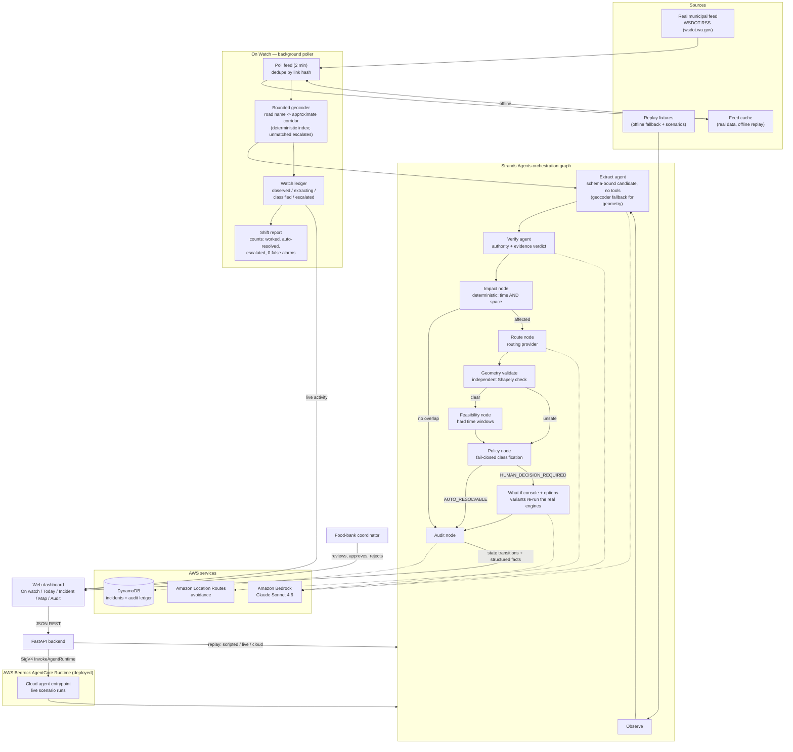
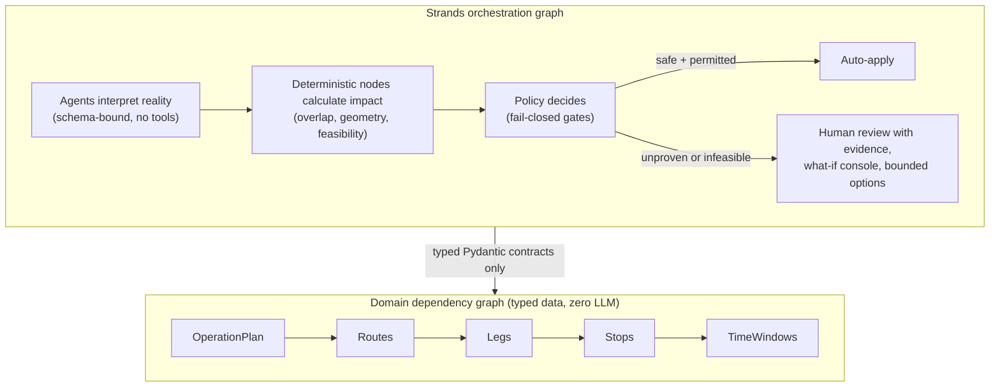

# CivicRipple Architecture

Render the mermaid blocks below (GitHub renders them natively). PNG exports
for the submission are generated with `scripts/render_diagrams.py`.

## System flow (submission diagram)

## The two-graph separation (core thesis)

Key invariants: LLM output is never operational truth until schema-validated; geometry/feasibility/policy contain no LLM calls; provider avoidance is independently validated (provider notices AND local geometry); the LLM never invents geometry (deterministic corridor index or escalate); silence is never approval; every transition is audited with structured facts.
