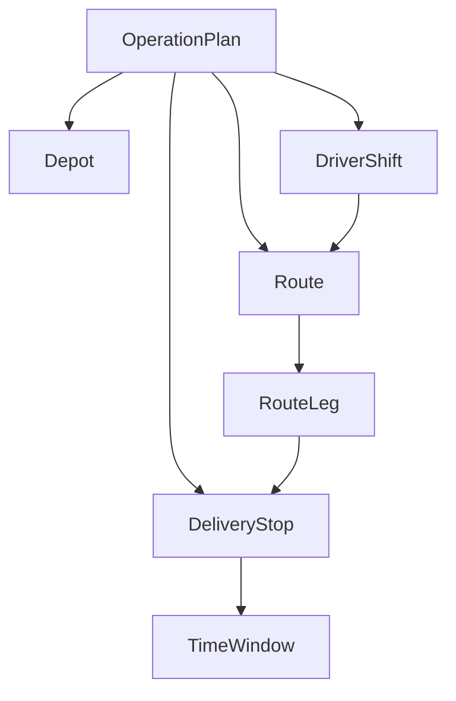
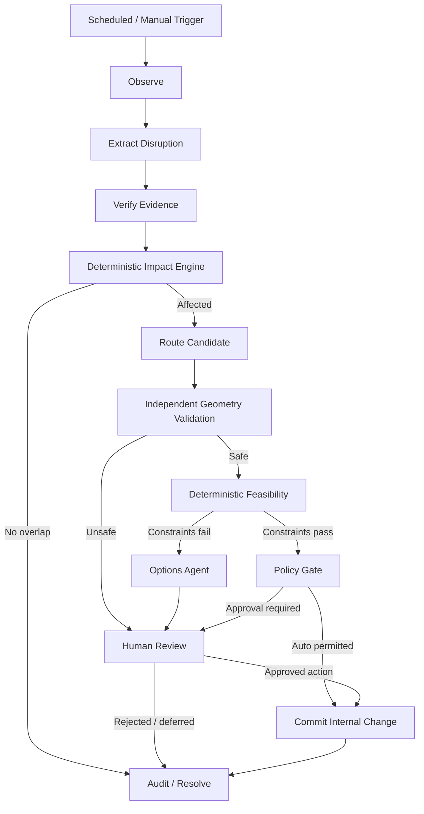
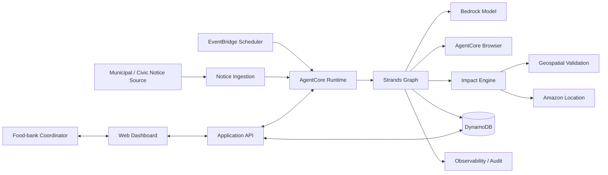
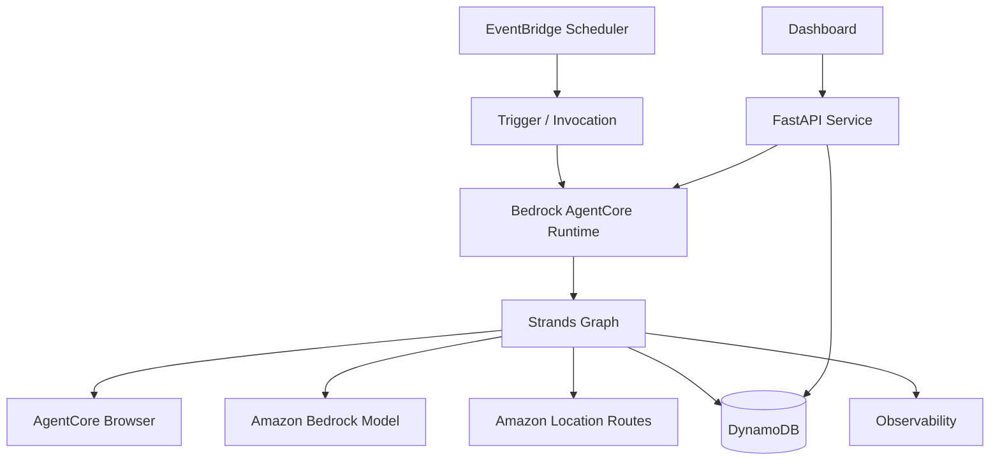

# CivicRipple — Architecture Design

**Status:** Design freeze candidate  
**Hackathon:** Agents for Humans Hackathon 2026  
**Target:** Good Neighbor Agents  

## 1. Architectural thesis

> **LLMs interpret changing external reality. Deterministic systems calculate operational impact. Strands orchestrates the two and decides when the human must return.**

CivicRipple deliberately separates agent reasoning from operational truth. Language models may understand a messy civic notice and explain consequences, but they do not decide whether a route geometrically intersects a closure, whether a time window is violated, or whether a policy permits an action.

## 2. Two-graph architecture

CivicRipple uses two graph concepts that must never be conflated.

### 2.1 Domain dependency graph

Represents the food-bank operation itself. It is typed application data and deterministic relationships, not an LLM graph.



### 2.2 Strands orchestration graph

Represents how an incident is processed.



The Strands Graph may contain agent nodes and deterministic custom nodes. Conditional edges route execution based on typed results rather than free-form text.

## 3. System context



## 4. Recommended stack

| Layer | Choice | Reason |
|---|---|---|
| Language | Python 3.11+ | Best fit for Strands Python graph features, Pydantic, Shapely, testing, geospatial logic |
| Agent SDK | Strands Agents SDK | Required hackathon technology; Graph provides deterministic orchestration |
| Model | Amazon Bedrock model via Strands | Sponsor-native and deployable through AgentCore |
| Agent hosting | Amazon Bedrock AgentCore Runtime | Background/cloud deployment strengthens technical implementation |
| Browser | AgentCore Browser | Handles inconsistent public civic sources when an API/feed is unavailable |
| Scheduler | Amazon EventBridge Scheduler | Background trigger independent of user interaction |
| Routing | Amazon Location Service Routes | Route matrix/route calculation and avoidance support |
| Schemas | Pydantic v2 | Strict typed boundary between probabilistic and deterministic components |
| Geometry | Shapely | Deterministic spatial predicates and closure-route intersection checks |
| Persistence | DynamoDB | Simple AWS-native incident/plan/audit persistence |
| API | FastAPI | Thin typed application surface for dashboard/demo |
| UI | React/Vite or minimal Next.js | Small judge-facing operational dashboard; no frontend complexity should block backend demo |
| Tests | pytest | Deterministic fixture and contract tests |
| Observability | AgentCore observability + application audit records | Judge-visible execution trace and debugging |

## 5. Repository boundaries

```text
civicripple/
├── CLAUDE.md
├── README.md
├── LICENSE
├── pyproject.toml
├── uv.lock
├── .env.example
├── docs/
│   ├── architecture.md
│   └── hackathon-build/
│       └── scope.md
├── src/
│   └── civicripple/
│       ├── app.py
│       ├── config.py
│       ├── domain/
│       │   ├── models.py
│       │   ├── enums.py
│       │   ├── policies.py
│       │   └── errors.py
│       ├── agents/
│       │   ├── disruption_extractor.py
│       │   ├── evidence_verifier.py
│       │   └── options_agent.py
│       ├── orchestration/
│       │   ├── graph.py
│       │   ├── state.py
│       │   └── nodes/
│       │       ├── observe.py
│       │       ├── impact.py
│       │       ├── route.py
│       │       ├── geometry_validate.py
│       │       ├── feasibility.py
│       │       ├── policy.py
│       │       └── audit.py
│       ├── services/
│       │   ├── civic_source.py
│       │   ├── amazon_location.py
│       │   ├── geometry.py
│       │   ├── feasibility.py
│       │   ├── storage.py
│       │   └── audit.py
│       ├── api/
│       │   ├── routes_incidents.py
│       │   ├── routes_operations.py
│       │   └── routes_review.py
│       └── fixtures/
│           ├── operation_plan.json
│           └── notices/
├── tests/
│   ├── unit/
│   ├── integration/
│   ├── contract/
│   └── scenarios/
├── infra/
│   ├── agentcore/
│   └── scheduler/
└── web/
    └── ... lightweight dashboard ...
```

### Boundary invariant

- `agents/` may produce typed domain proposals, never perform operational calculations.
- `services/geometry.py` and `services/feasibility.py` contain no LLM calls.
- `orchestration/` coordinates nodes but does not duplicate domain logic.
- AWS SDK calls are isolated behind `services/` adapters.
- API/UI never call AWS services directly.

## 6. Core data contracts

### 6.1 DisruptionEvent

```python
class DisruptionEvent(BaseModel):
    event_id: str
    type: DisruptionType
    authority: str
    source_url: str | None
    published_at: datetime | None
    valid_from: datetime
    valid_until: datetime | None
    geometry: GeoShape
    severity: DisruptionSeverity
    facts: list[EvidenceFact]
    verification_status: VerificationStatus
```

### 6.2 EvidenceFact

```python
class EvidenceFact(BaseModel):
    field: str
    value: str
    source: str
    source_kind: SourceKind
    observed_at: datetime
    excerpt_hash: str
```

Do not persist large copyrighted page bodies in the evidence object. Store only minimal provenance, hashes, and short factual snippets where appropriate.

### 6.3 OperationPlan

```python
class OperationPlan(BaseModel):
    operation_id: str
    service_date: date
    depot: LocationPoint
    driver_shifts: list[DriverShift]
    routes: list[RoutePlan]
```

### 6.4 RoutePlan

```python
class RoutePlan(BaseModel):
    route_id: str
    driver_id: str
    stops: list[DeliveryStop]
    legs: list[RouteLeg]
```

### 6.5 ImpactAssessment

```python
class ImpactAssessment(BaseModel):
    disruption_id: str
    operation_id: str
    affected_route_ids: list[str]
    affected_leg_ids: list[str]
    affected_stop_ids: list[str]
    temporal_overlap: bool
    spatial_overlap: bool
    reasons: list[str]
```

`reasons` must be generated from deterministic facts, not hidden model reasoning.

### 6.6 RouteCandidate

```python
class RouteCandidate(BaseModel):
    route_id: str
    provider: str
    geometry: GeoShape
    distance_m: int
    duration_s: int
    provider_notices: list[str]
    independently_clear_of_disruption: bool
```

### 6.7 FeasibilityResult

```python
class FeasibilityResult(BaseModel):
    feasible: bool
    stop_arrivals: list[StopArrival]
    violations: list[ConstraintViolation]
    added_duration_s: int
```

### 6.8 IncidentDecision

```python
class IncidentDecision(BaseModel):
    classification: Literal[
        "NO_IMPACT",
        "AUTO_RESOLVABLE",
        "HUMAN_DECISION_REQUIRED",
    ]
    permitted_action: str | None
    review_reason: str | None
```

## 7. State machine

```text
DETECTED
  -> EXTRACTED
  -> VERIFIED
  -> IMPACT_ASSESSED
      -> NO_IMPACT -> RESOLVED
      -> ROUTE_REQUESTED
          -> CANDIDATE_REJECTED -> REVIEW_REQUIRED
          -> CANDIDATE_VALIDATED
              -> FEASIBLE -> POLICY_EVALUATED
                    -> AUTO_APPROVED -> RESOLVED
                    -> REVIEW_REQUIRED
              -> INFEASIBLE -> REVIEW_REQUIRED
  -> REVIEW_REQUIRED
      -> HUMAN_APPROVED -> RESOLVED
      -> HUMAN_REJECTED -> OPEN
```

Every state transition writes an append-only audit event.

## 8. Deterministic impact algorithm

For each planned route leg:

1. test temporal overlap between disruption validity and planned traversal;
2. if no overlap, skip;
3. test spatial intersection between route geometry and disruption geometry;
4. collect affected legs/stops;
5. if none remain, classify `NO_IMPACT`;
6. otherwise request a route candidate avoiding the disruption;
7. reject the route if provider notices indicate avoidance violation or local Shapely validation still intersects the disruption;
8. recompute arrival times using candidate duration/leg durations;
9. evaluate every hard delivery time window;
10. pass only a typed `FeasibilityResult` into the policy node.

No LLM call is allowed in steps 1–10.

## 9. Policy matrix

| Situation | Default action |
|---|---|
| No operational intersection | Resolve silently |
| Safe reroute; same recipients; all hard constraints pass; no external notification required | Auto-apply internal proposed route |
| Avoidance cannot be proven | Human review |
| Any hard time-window violation | Human review |
| Delivery cancellation/removal proposed | Human review |
| Volunteer reassignment proposed | Human review |
| Venue change proposed | Human review |
| External mass communication proposed | Human review |
| Missing/ambiguous source geometry | Human review or no action; never infer closure geometry freely |

## 10. Failure and degradation behavior

### Model/Bedrock unavailable

- Do not fabricate an event.
- Mark source observation `EXTRACTION_FAILED`.
- Preserve the operation plan unchanged.
- Dashboard shows degraded monitoring state.
- Fixture/replay mode remains available for the demo.

### AgentCore Browser unavailable

- Fall back to configured HTTP/RSS/fixture source adapter when available.
- Never claim live verification occurred if the browser path failed.

### Amazon Location unavailable

- Do not auto-resolve an affected incident.
- Classify as `HUMAN_DECISION_REQUIRED` with reason `ROUTING_UNAVAILABLE`.
- Demo fixture adapter can provide recorded deterministic route responses only when running in explicit replay mode.

### DynamoDB unavailable

- Do not execute consequential state changes that cannot be audited.
- Local development may use a file/in-memory repository adapter, but production mode fails closed.

### Malformed civic notice

- Extraction validation failure stops the graph before impact assessment.

### Ambiguous/low-authority source

- Verification node marks event unverified.
- Impact may be previewed, but no automatic operational action is committed.

### Routing avoidance not honored

- Reject candidate after provider-notice inspection and independent geometry check.

### UI unavailable

- Backend orchestration remains functional.
- Human-required incidents stay pending; no implicit approval.

## 11. Optional-service degradation invariant

The application must build and run locally without AWS credentials using fixture adapters.

Two explicit modes:

- `MODE=local_replay` — deterministic fixtures; no AWS required.
- `MODE=aws` — real Bedrock/AgentCore/Amazon Location/DynamoDB adapters.

Local fallback must never silently masquerade as live AWS execution. The UI must display the active mode.

## 12. Security and privacy

- No AWS keys in the repository.
- `.env` excluded; `.env.example` contains names only.
- Prefer IAM roles in deployed environments.
- Do not store sensitive recipient details beyond what the demo requires.
- Demo fixture recipients use synthetic IDs/addresses.
- Civic source content is treated as untrusted input.
- Prompt injection from browsed civic pages must not be able to invoke operational tools directly; extraction produces schema-bound data that deterministic nodes validate before actions.
- Tool permissions follow least privilege.

## 13. Prompt-injection boundary

The browser/extraction agent is an **untrusted-data interpreter**.

It cannot call:

- route commit,
- operation mutation,
- notification,
- human-approval mutation.

Its only allowed output is `DisruptionEventCandidate` / evidence data. The verification and deterministic layers decide whether that candidate advances.

## 14. API surface

Minimal judge-facing API:

```text
GET  /health
GET  /mode
GET  /operations/{id}
GET  /incidents
GET  /incidents/{id}
POST /incidents/{id}/replay
POST /incidents/{id}/review
GET  /audit/{incident_id}
```

The dashboard only needs these contracts.

## 15. Dashboard scope

Three views are enough:

1. **Today** — operation status, deliveries, routes, current monitoring state.
2. **Incident** — source notice, affected route/stops, proposed alternative, deterministic constraints, classification.
3. **Audit** — compact timeline showing agent nodes, deterministic checks, tool calls, approvals, and final outcome.

Do not build a full admin system.

## 16. Testing strategy

### Unit tests

- interval overlap;
- geometry intersection;
- route candidate validation;
- arrival-time propagation;
- hard time-window feasibility;
- policy classification;
- state transition validation.

### Contract tests

- Pydantic extraction schema;
- Amazon Location adapter response normalization;
- persistence repository contract;
- Strands graph node input/output shapes.

### Scenario tests

The five MVP acceptance scenarios from `docs/hackathon-build/scope.md` must be executable as deterministic tests.

### Agent tests

Use fixed civic notices and evaluate:

- extraction completeness;
- unsupported fact invention;
- authority/source preservation;
- correct geometry/time extraction when explicit;
- refusal to invent missing geometry.

## 17. Observability and audit

Every incident receives a correlation ID. Record:

- trigger;
- source identifiers;
- extracted structured event;
- verification result;
- deterministic impact result;
- routing request/response metadata;
- geometry validation;
- feasibility result;
- policy result;
- human approval/rejection;
- final state;
- timestamps and latency.

Do not record model private chain-of-thought. Expose only structured decisions, evidence, tool results, and deterministic reasons.

## 18. AWS deployment shape



For the hackathon, infrastructure should be minimal. Do not add services merely to make the AWS diagram larger.

## 19. Phase boundaries

### Phase 0 — contracts and fixtures

- repository skeleton;
- Pydantic schemas;
- operation fixture;
- three civic-notice fixtures;
- deterministic scenario expectations.

### Phase 1 — deterministic core

- temporal impact;
- geospatial intersection;
- route-candidate interface;
- candidate geometry validation;
- feasibility/time-window engine;
- policy engine;
- scenario tests.

**No real LLM or dashboard is required to complete Phase 1.**

### Phase 2 — Strands integration

- extractor agent;
- verifier;
- Strands Graph;
- options explanation agent;
- structured audit events;
- local replay orchestration.

### Phase 3 — AWS integration

- Bedrock model;
- Amazon Location adapter;
- AgentCore Runtime;
- Browser where justified;
- DynamoDB;
- EventBridge schedule;
- observability.

### Phase 4 — demo product

- dashboard;
- human-review action;
- replay controls;
- metrics;
- polished incident story.

### Phase 5 — submission hardening

- public repo cleanup;
- MIT/Apache license;
- README/setup;
- architecture export;
- tests;
- live deployment if stable;
- demo video.

## 20. Architecture invariants

1. LLM output is never operational truth until schema validated.
2. Geometry/time-window feasibility contains no LLM calls.
3. External webpage content cannot directly invoke mutation tools.
4. Automatic action requires both deterministic feasibility and policy permission.
5. Missing audit persistence fails closed for consequential actions.
6. Routing-provider avoidance is independently validated.
7. Human-required incidents never expire into implicit approval.
8. Fixture mode and live AWS mode are visibly distinct.
9. Every service has an adapter boundary and test double.
10. The MVP optimizes for a single end-to-end workflow, not feature count.

## 21. Deferred architecture

Do not implement until the MVP is complete:

- OR-Tools/Timefold fleet-wide optimization;
- SMS/voice notification adapters;
- multi-tenant identity;
- multiple municipalities;
- broad incident ontology;
- volunteer backup marketplace;
- advanced spatial database;
- graph database;
- long-term analytics platform.

## 22. Design review decision

This architecture is ready to proceed into implementation planning once the following are accepted as fixed:

- one road-closure workflow;
- two-graph separation;
- Python stack;
- deterministic impact/feasibility core;
- fail-closed policy;
- explicit local replay mode;
- no full fleet optimization in MVP.
